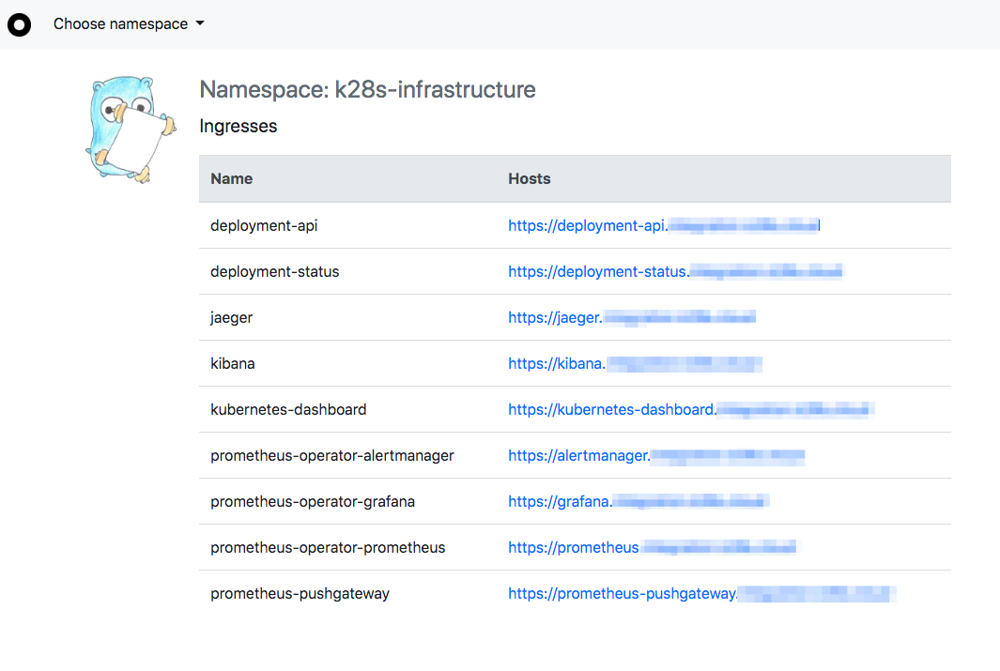
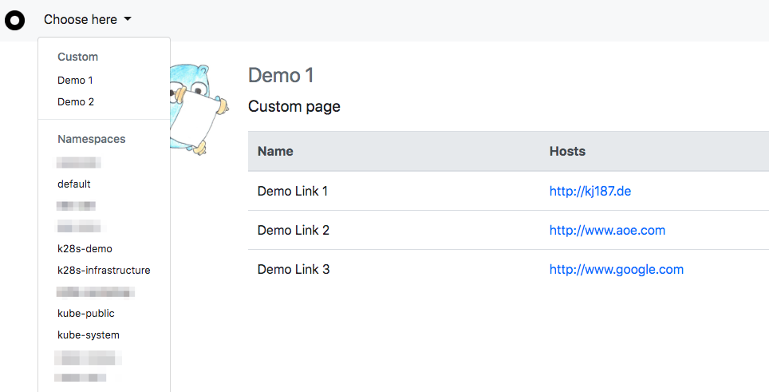

# Kubernetes Ingress Linklist


[](https://github.com/kj187/kubernetes-ingress-linklist/actions?query=workflow%3Apipeline)

UI with a list of all available Kubernetes ingresses per namespace

## Example UI



## Installing

### Installing via Helm Chart

```
$ git clone https://github.com/kj187/kubernetes-ingress-linklist.git
$ cd kubernetes-ingress-linklist/chart
$ helm lint k8s-ingress-linklist ./k8s-ingress-linklist
$ helm upgrade --install k8s-ingress-linklist ./k8s-ingress-linklist

# for minikube on localhost add the ingress
$ IP=$(minikube ip) echo "${IP} k8s-ingress-linklist.local" | sudo tee -a /etc/hosts
```

### Installing via kubectl

```
$ git clone https://github.com/kj187/kubernetes-ingress-linklist.git
$ cd kubernetes-ingress-linklist
$ kubectl apply -f deploy/

# for minikube on localhost add the ingress
$ IP=$(minikube ip) echo "${IP} k8s-ingress-linklist.local" | sudo tee -a /etc/hosts
```


## Custom pages

It is also possible to add custom pages via settings. 
To do that, just create a new ConfigMap and mount this into the `kubernetes-ingress-linklist`.

The mount path must be `/kubernetes-ingress-linklist` and the filename must be `settings.yaml` 

**Example file:** `chart/k8s-ingress-linklist/templates/configmap.yaml`
**Example content**:
```
customPages:
  demo1:
    title: Demo 1
    links:
    - title: Demo Link 1
      link: http://kj187.de
    - title: Demo Link 2
      link: http://www.aoe.com
    - title: Demo Link 3
      link: http://www.google.com
  demo2:
    title: Demo 2
    links:
    - title: Demo 2 Link 1
      link: http://kj187.de
```




## Index page redirect

You can set a temporary redirect via settings. The default behaviour is a redirect to the `default` namespace.

```
redirectRootPageTo: /default
```

You can change this by overriding the value. You can add a namespace or a custom page (keep in mind to prefix the path with `custom/`). 
Example: 

```
redirectRootPageTo: /custom/demo1
customPages:
  demo1:
    title: Demo 1
    links:
    - title: Demo Link 1
      link: http://kj187.de
```